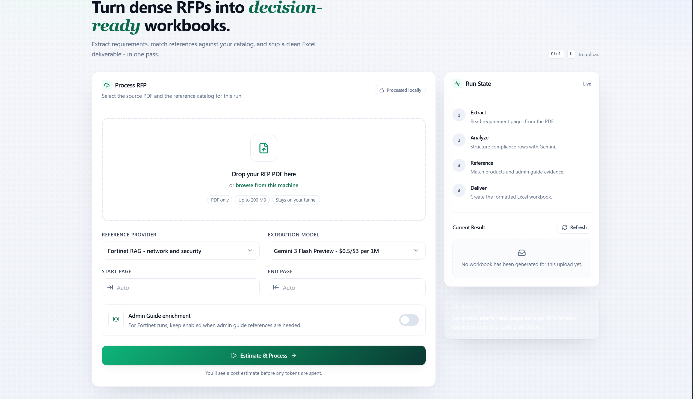

# Request for Proposal Technical Extraction Pipeline

The Request for Proposal (RFP) Technical Extraction Pipeline is an enterprise-grade, document intelligence system designed to automate the process of identifying, parsing, and resolving technical requirements from dense PDF documents. The system isolates compliance tables, matches requirements against multi-vendor product catalogs (Fortinet, Juniper, and Vertiv) to recommend specific hardware models, and enriches output sheets with deep-link documentation citations using semantic search.

The final output is generated as a structured Excel workbook with professional styling, clear compliance tracking, and automated citation links.



## Key Capabilities

### Heuristic Section Detection

The pipeline executes a pre-processing step using local heuristic analysis to detect the exact page range containing the technical specifications or Bill of Quantities (BOQ). This isolates requirement tables without incurring LLM API costs or token overhead from cover pages, indices, and legal terms.

### AI-Driven Table Parsing

Using Google Gemini models, the pipeline parses complex, multi-column, and nested requirement tables. The model segments documents, extracts text context, and outputs formatted JSON structures that map directly to standard compliance schemas.

### Multi-Vendor Catalog Alignment

The pipeline contains dedicated RAG (Retrieval-Augmented Generation) and rule-based matching engines for three primary hardware vendors:

- **Fortinet**: Resolves next-generation firewalls (NGFW), switches, logging platforms, access points, and software licenses.
- **Juniper**: Matches routing, switching, and security requirements against the Juniper catalog (including SRX, EX, QFX, MX, ACX, and PTX series).
- **Vertiv**: Matches power distribution units (PDU), critical uninterruptible power supplies (UPS), Liebert thermal cooling systems, rack enclosures, and environmental monitoring devices.

### Semantic Admin Guide Citations

For Fortinet solutions, the pipeline matches the extracted requirements against the FortiOS Administration Guide index using sentence embeddings and cosine similarity. It embeds exact chapter and page-level deep-link citations into the generated spreadsheet as audit evidence.

### Pre-flight Cost Estimation

Before initiating any API processing, the system runs a token cost calculation. It checks the target PDF page count, estimates the required input/output tokens, applies vendor pricing configurations, and prompts the operator with a budget confirmation modal. The estimator includes adjustments for scanned documents by enforcing a page character floor.

### Enterprise Web Dashboard

A responsive, single-page web dashboard provides a visual interface for managing uploads, selecting target models and vendors, setting custom page ranges, reviewing pre-flight estimates, and monitoring execution stages in real time.

---

## Architecture and Technology Stack

The pipeline consists of a Python 3.9+ backend, a modular data matching pipeline, and a modern frontend.

### Core Dependencies

- **Backend Framework**: Flask and Gunicorn for running scalable, concurrent web operations.
- **Artificial Intelligence**: Google GenAI SDK (Gemini Pro and Flash models).
- **Embeddings & Vector Search**: Sentence-Transformers (utilizing the all-MiniLM-L6-v2 model), Scikit-Learn, and NumPy for semantic matching.
- **String Processing**: RapidFuzz for token-ratio and Levenshtein-based matching.
- **PDF Manipulation**: PyMuPDF (Fitz) for high-performance page extraction and text scraping, PyPDF, and PDFPlumber.
- **Data Engineering**: Pandas and OpenPyXL for data frame transformation, Excel styling, and conditional formatting.

---

## Directory Structure

```
vagent/
├── app.py                      # Flask web server and routing controller
├── main_pipeline.py            # End-to-end pipeline orchestrator
├── requirements.txt            # System dependencies and versions
├── gunicorn_config.py          # Configuration for production Gunicorn workers
├── deploy.sh                   # Production deployment script
├── scripts/
│   ├── cost_estimator.py       # API token usage and price estimation module
│   ├── gemini_extractor.py     # Gemini extraction prompt and parsing logic
│   ├── local_section_detector.py # Pre-extraction PDF heuristic scanner
│   ├── json_to_excel.py        # Excel report generator and styling engine
│   ├── pdf_segmenter.py        # Document page slicing utility
│   ├── pdf_admin_metadata.py   # PDF bookmark and metadata extraction tool
│   ├── product_matcher.py      # Base vendor matching helper functions
│   ├── reference_injector.py   # Rule-based catalog matching controller
│   ├── fortinet/               # Fortinet-specific matching and guide citation
│   ├── juniper/                # Juniper-specific matching and data structures
│   └── vertiv/                 # Vertiv-specific matching and data structures
├── data/
│   ├── Complete RFPs/          # Input directory for processing PDFs
│   ├── product_catalogs/       # Scraped product data (Fortinet, Juniper, Vertiv)
│   ├── Reference dataset/      # Reference documents (FortiOS Admin Guide PDF)
│   └── navigation/             # Pre-built semantic indexes and flat JSON structures
└── output/                     # Directory for generated reports and temp files
```

---

## Configuration Variables

System configurations are loaded from environment variables defined in a `.env` file at the project root.

| Environment Variable               | Description                                                      | Default Value               |
| :--------------------------------- | :--------------------------------------------------------------- | :-------------------------- |
| `GOOGLE_API_KEY`                 | Developer API key for Google Gemini model access.                | None (Required)             |
| `FLASK_SECRET_KEY`               | Secret key for Flask session signing and CSRF security.          | `vagent-local-dev-secret` |
| `MAX_UPLOAD_MB`                  | Maximum allowed file size for PDF uploads via the web UI.        | `200`                     |
| `OUTPUT_TOKEN_RATIO`             | Scaling factor to estimate output tokens relative to input size. | `2.00`                    |
| `VERTIV_USE_SENTENCE_EMBEDDINGS` | Enables semantic search matching for Vertiv equipment.           | `1`                       |
| `VERTIV_EMBEDDING_MODEL`         | HuggingFace embedding model name for Vertiv RAG matcher.         | `all-MiniLM-L6-v2`        |
| `JUNIPER_RAG_TOP_K`              | Number of catalog candidates retrieved for Juniper matching.     | `8`                       |
| `FORTINET_RAG_INCLUDE_JUNIPER`   | Allows Fortinet matchers to reference Juniper fallback items.    | `1`                       |

---

## Installation and Deployment

### 1. Repository Setup

Clone the codebase and navigate to the project directory:

```bash
git clone https://github.com/your-username/rfp-extractor.git
cd rfp-extractor
```

### 2. Environment Installation

Install the required packages using pip:

```bash
pip install -r requirements.txt
```

### 3. Environment File Configuration

Create a `.env` file in the root folder:

```env
GOOGLE_API_KEY=your_gemini_api_key_here
FLASK_SECRET_KEY=generate_a_secure_random_key_here
MAX_UPLOAD_MB=200
```

---

## Execution Procedures

### Web Interface Mode

Start the Flask development server:

```bash
python app.py
```

To access the dashboard, open your browser and navigate to `http://127.0.0.1:5000`.

Using the interface:

1. Drag and drop the target RFP PDF file into the upload zone.
2. Select the appropriate **Reference Provider** (Fortinet, Juniper, or Vertiv).
3. Choose the extraction model (such as Gemini 3.5 Flash).
4. Define a custom start and end page range if you want to bypass automatic heuristic detection.
5. Click **Estimate & Process** to review the estimated API costs, then confirm execution to generate and download the formatted Excel report.

### CLI Batch Mode

For batch jobs or automation scripts, use the command-line orchestrator:

```bash
python main_pipeline.py [arguments]
```

#### Command-Line Arguments

- `--input`: Path to a specific RFP PDF file. If this flag is omitted, the script runs in batch mode and processes all files located in the `data/Complete RFPs/` directory.
- `--reference-provider`: Catalog database to match specifications against. Choices are `fortinet`, `fortinet-rag`, `fortinet-rules`, `deterministic`, `vertiv`, and `juniper` (Default: `fortinet`).
- `--skip-enrichment`: Bypasses the Fortinet Admin Guide citation lookup, outputting hardware recommendations only.
- `--model`: Specific Gemini model ID to execute for requirements table parsing.

#### Example Commands

Run a single file through the Juniper matching engine:

```bash
python main_pipeline.py --input "data/Complete RFPs/RFP_Security_Network.pdf" --reference-provider juniper
```

Run batch operations for Vertiv power infrastructure recommendations, skipping Admin Guide steps:

```bash
python main_pipeline.py --reference-provider vertiv --skip-enrichment
```

---

## Development and Contributions

For details on database structures, scraping routines, or custom RAG embeddings, refer to the source files within the `scripts/` directory. Contributions should be submitted via branch pull requests following standard code reviews.